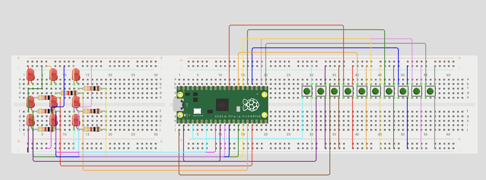

# EXAM 1 

**Goal::** _To develop a code that solves the challenge posed by the professor, using the knowledge learned during the first block of the course_ 
 **Prediction:** _We expect to be able to solve the challenge on time and in the correct manner, applying the tools we have learned_

 ## Set Up 
Armamos el circuito utilizando una Raspberry Pi Pico 2w, 10 botones y una matriz de 9 LEDs. Todos los componentes fueron conectados a los pines GPIO de la Raspberry para poder controlar y detectar las señales de entrada y salida.

### What I did

### Evidence 

### Code
        
### What went wrong

### Disclosure

