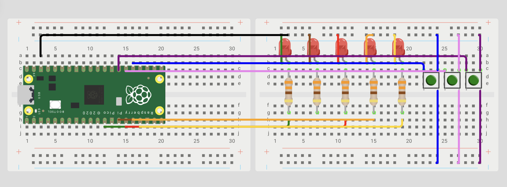

# Sesion 3 Interrupts 

**Goal:** _Configure a GPIO as a digital input to detect the state of a button (HIGH or LOW) and use this information to control an LED._

**Prediction:** _It is expected that when the button connected to the GPIO is pressed, it will detect a low logic level (0) due to the external pull-up resistor and turn on the LED. When the button is released, the GPIO will have a high logic level (1) and the LED will turn off._

## Exercise 1 Roulette 

## Set Up 

The 5 LEDs are connected to 5 GPIO pins configured as outputs, while the 3 buttons are connected to other GPIO pins configured as inputs.



### What I did
Three buttons were connected to GPIO inputs on the Raspberry Pi Pico 2W to control the LED sequence using interrupts. Pressing a button generates an interrupt that allows a specific action to be executed in real time, without stopping the main program. One button increases the speed of the sequence, another decreases it, and the third momentarily turns on all the LEDs before continuing the sequence.

### Evidence 
<iframe width="560" height="315" src="https://www.youtube.com/embed/HhzLsmht66k?si=y9bpBK5MCvZms2d2" title="YouTube video player" frameborder="0" allow="accelerometer; autoplay; clipboard-write; encrypted-media; gyroscope; picture-in-picture; web-share" referrerpolicy="strict-origin-when-cross-origin" allowfullscreen></iframe>

### Code
```
#include "pico/stdlib.h"
#include "hardware/gpio.h"
#include "hardware/structs/sio.h"
#include <stdio.h>
 
#define led1 9,10,11,12,13
#define Btn1 19,20,21
 
volatile int pos = 0;
volatile int vel=200;
const uint32_t MASK = (1u<<led1) | (1u<<led2) | (1u<<led3) | (1u<<led4) |(1u<<led5) ;
 
static void FUNCION_STOP(uint GPIO, uint32_t event){
    if(GPIO == Btn1 && event==GPIO_IRQ_EDGE_RISE ){
        printf("botonok \n");
        if(pos==2){
            printf("ganaste\n");
            for(int i=0;i<3;i++){
                sio_hw->gpio_set = MASK;
                busy_wait_ms(100);
                sio_hw->gpio_clr =MASK;
                busy_wait_ms(100);
            }
        }
    }
     if(GPIO == Btn2 && event == GPIO_IRQ_EDGE_RISE){
        vel -= 30;
        if(vel < 40) vel = 40; // límite para que no quede absurdo
        printf("velocidad: %d\n", vel);
    }
        if(GPIO == Btn3 && event == GPIO_IRQ_EDGE_RISE){
        vel += 30;
        if(vel > 500) vel = 500; // límite para que no quede eterno
        printf("velocidad: %d\n", vel);
    }
    gpio_acknowledge_irq(GPIO, event);
}
 
int main() {
   stdio_init_all();
   gpio_init(led1); // lo mismo hasta el led 5
   gpio_init(Btn1); // lo mismo hasta el boton 3
   gpio_set_dir(Btn1,0);
   gpio_set_dir(Btn2,0);
   gpio_set_dir(Btn3,0);
   gpio_pull_up(Btn1);
   gpio_pull_up(Btn2);
   gpio_pull_up(Btn3);
 
   sio_hw->gpio_oe_set = MASK; //salida
   int pause=0;
   int counter =0;
   int dir = 1;      //direccion
   //FUNCIO NDE INTERR
   gpio_set_irq_enabled_with_callback(Btn1,GPIO_IRQ_EDGE_RISE,true,&FUNCION_STOP);
   gpio_set_irq_enabled(Btn2, GPIO_IRQ_EDGE_RISE, true);
   gpio_set_irq_enabled(Btn3, GPIO_IRQ_EDGE_RISE, true);
   
   while (true) {
        for(pos=0;pos<=4;pos++)
      { sio_hw->gpio_set = (1u<<pos+9);
       sleep_ms(vel);
       sio_hw->gpio_clr = (1u<<pos+9);
       sleep_ms(vel);}
    for(pos=4;pos>=0;pos--)
      { sio_hw->gpio_set = (1u<<pos+9);
       sleep_ms(vel);
       sio_hw->gpio_clr = (1u<<pos+9);
       sleep_ms(vel);}
   }
}
```
### What went wrong
The problem arose when trying to increase or decrease the speed, as we were misusing ``` vel```. It existed before, but we never used it; instead, we used ``` sleep_ms(200)```, which made it wait 200 milliseconds, always, and the logic of +/- 30 was lost.

### Disclosure
* We learned that interrupts allow the microcontroller to detect a change in a signal and respond immediately, without having to constantly monitor the input. Furthermore, we learned that it can detect both rising and falling edges, so a function can be activated precisely when the state change occurs, without having to wait for the signal to arrive and remain at 0 or 1.


