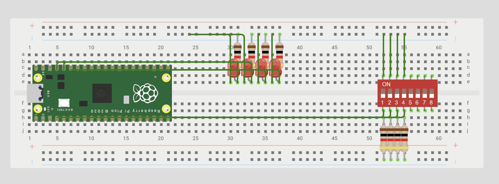

# Sesion 2 - Digital inputs

**Goal:** _Configurar un GPIO como entrada digital para detectar el estado de un botón (HIGH o LOW) y utilizar esta información para controlar un LED.._

**Prediction:** _Se espera que al presionar el botón conectado al GPIO, detecte un nivel lógico bajo (0) debido al pull-up externo y encienda el LED. Al soltar el botón, el GPIO tendrá un nivel lógico alto (1) y el LED se apagará._



### Set Up 
In this exercise we used the Raspberry Pi Pico 2W, connected to a 4-input switch and 4 LEDs. In most of the exercises we used only two switches and two LEDs, except for the last exercise, in which we used all four LEDs.

## Exercise 1.1 AND

### What I did
What we did was use an AND gate. The program checks if SW0 and SW1 are HIGH (1). Since the buttons have a pull-up resistor, HIGH means they are not pressed. If both are HIGH, the AND condition is met and gpio_set turns on the LED. If one or both are LOW (0), the condition is false and gpio_clr turns off the LED.

### Evidence 
<iframe width="560" height="315" src="https://www.youtube.com/embed/rilfPv1joAg?si=a3J3w2M-qkvO5dwY" title="YouTube video player" frameborder="0" allow="accelerometer; autoplay; clipboard-write; encrypted-media; gyroscope; picture-in-picture; web-share" referrerpolicy="strict-origin-when-cross-origin" allowfullscreen></iframe>

### Code
``` 
       while (true) {
        // With an (external) pull-up, pressed = 0 (low level)
        if ((sio_hw->gpio_in & SW0_BIT && sio_hw->gpio_in & SW1_BIT )) {
            sio_hw->gpio_set = LED_AND_BIT;   // LED on
            printf("ON");
        } else {
            sio_hw->gpio_clr = LED_AND_BIT;   // LED Off
            printf("OFF");
            }
       }
```

## Exercise 1.2 OR 

### What I did
What we did was use an OR gate. The program checks if SW0 or SW1 are HIGH (1). If either is HIGH, the OR condition is met and the LED turns on. The LED only turns off when both buttons are LOW (0), since in that case neither condition is met and the LED turns off.

### Evidence 
<iframe width="560" height="315" src="https://www.youtube.com/embed/JCdVKcYEekI?si=3ob2uIqgkvq58tOW" title="YouTube video player" frameborder="0" allow="accelerometer; autoplay; clipboard-write; encrypted-media; gyroscope; picture-in-picture; web-share" referrerpolicy="strict-origin-when-cross-origin" allowfullscreen></iframe>

### Code
``` 
        while (true) {
        // With an (external) pull-up, pressed = 0 (low level)
        if ((sio_hw->gpio_in & SW0_BIT || sio_hw->gpio_in & SW1_BIT )) {
            sio_hw->gpio_set = LED_OR_BIT;   // LED on
            printf("ON");
        } else {
            sio_hw->gpio_clr = LED_OR_BIT;   // LED Off
            printf("OFF");
        }
        }
```

## Exercise 1.3 XOR

### What I did
Here we are using an XOR gate, and we are looking at the states of SW0 and SW1. The LED turns on only when one is HIGH and the other is LOW. If both are HIGH or both are LOW, neither condition is met and the LED turns off.

### Evidence 
<iframe width="560" height="315" src="https://www.youtube.com/embed/XBOCYfJYCi4?si=IdaTBs2Bac99E9P6" title="YouTube video player" frameborder="0" allow="accelerometer; autoplay; clipboard-write; encrypted-media; gyroscope; picture-in-picture; web-share" referrerpolicy="strict-origin-when-cross-origin" allowfullscreen></iframe>

### Code
```    while (true) {
        // With an (external) pull-up, pressed = 0 (low level)
        if ((sio_hw->gpio_in & SW0_BIT) && !(sio_hw->gpio_in & SW1_BIT )) {
            sio_hw->gpio_set = LED_XOR_BIT;   // LED on
            printf("ON");
        }
        else if (!(sio_hw->gpio_in & SW0_BIT) && (sio_hw->gpio_in & SW1_BIT ))
        {
            sio_hw->gpio_set = LED_XOR_BIT;   // LED on
            printf("ON");
        }        
        else {
            sio_hw->gpio_clr = LED_XOR_BIT;   // LED Off
            printf("OFF");
        }
        sleep_ms(100);
```

## Exercise 2 

### What I did
In this code we use two buttons to control 4 LEDs, one button is used to increase the number from 0 to 3 and the other to decrease it from 3 to 0.

### Evidence 
<iframe width="560" height="315" src="https://www.youtube.com/embed/eUvwro2iH7g?si=nyCovm18Fm0YI6Qa" title="YouTube video player" frameborder="0" allow="accelerometer; autoplay; clipboard-write; encrypted-media; gyroscope; picture-in-picture; web-share" referrerpolicy="strict-origin-when-cross-origin" allowfullscreen></iframe>
YouTube
 
 ### Code
 ``` while (true) {
    // With an external pull-up, pressed = 0 (low level)
    if (!(sio_hw->gpio_in & (1u << PIN_BA)) && (flag == 0)) {
        counter++;
        flag = 1;
        sio_hw->gpio_clr = MASK;
    }
    else if (!(sio_hw->gpio_in & (1u << PIN_BB)) && (flag == 0)) {
        counter--;
        flag = 1;
        sio_hw->gpio_clr = MASK;
    }
    else if ((sio_hw->gpio_in & (1u << PIN_BA)) &&
             (sio_hw->gpio_in & (1u << PIN_BB))) {
        flag = 0;
    }
    if (counter > 3) {
        counter = 0;
    }
    else if (counter < 0) {
        counter = 3;
    }
    sio_hw->gpio_set = (1u << (counter + 10));
    sleep_ms(100);
}
```
## What went wrong


## Disclosure
