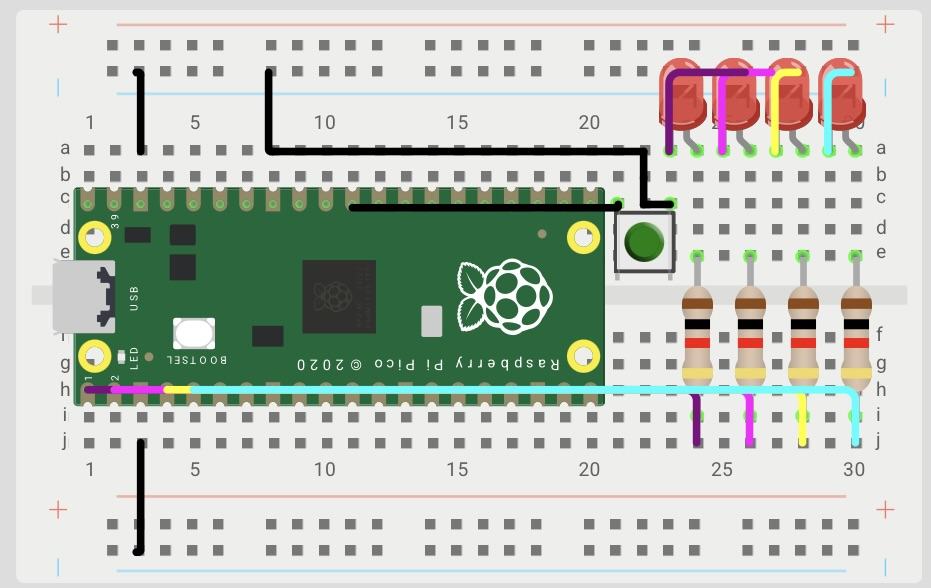

# Session 1 — GPIO Control

**Goal:** _Turn on the integrated LEDs as required in each exercise using masks and bitwise operations._

### Set Up 
A Raspberry Pi Pico 2W was used, connected to four LEDs via GPIO. Each LED has a current-limiting resistor connected to ground for protection. The four LEDs were used as a 4-bit representation.



## Exercise 1. 4-bit binary counter

### What I did
Using four LEDs, the binary representation from 0 to 15 must be displayed every second.

### Evidence 

### Predicted vs measured

### What went wrong

### Code
`` codigo
```
 sio_hw->gpio_oe_set = MASK;
   int pos = 0;       // LED inicial
   int counter =0;
   int dir = 1;       // Dirección: 1→derecha, -1→izquierda
   while (true) {
 
       sio_hw->gpio_set = (counter);
       sleep_ms(200);
       sio_hw->gpio_clr = (0b1111<<0);
       sleep_ms(200);
       counter++;
```

### Open question

### Disclosure

